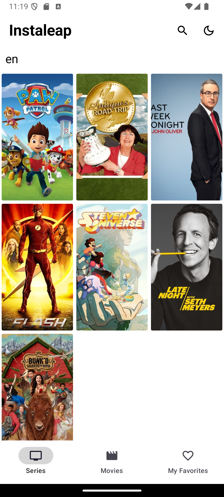
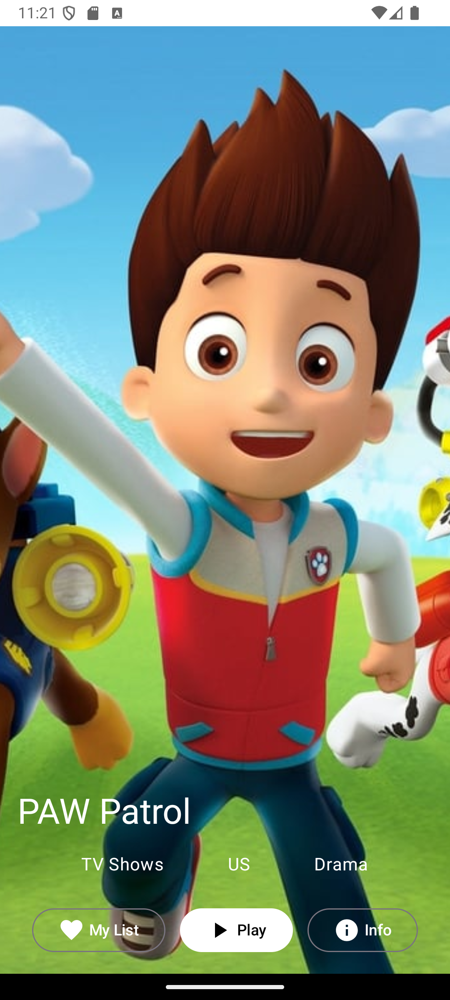
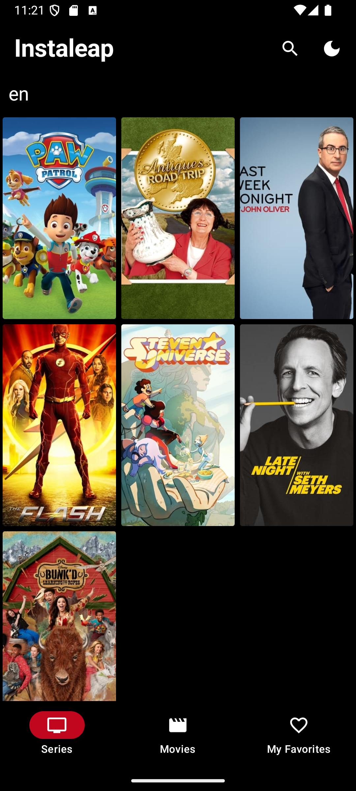
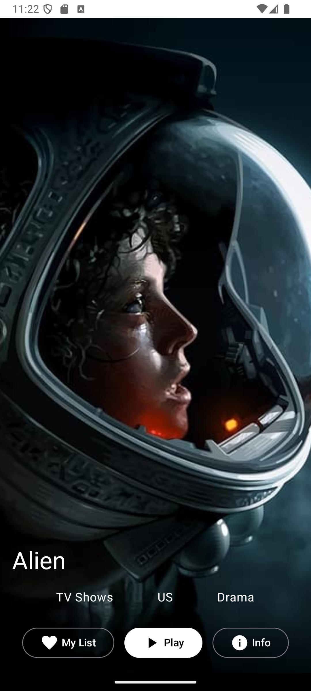
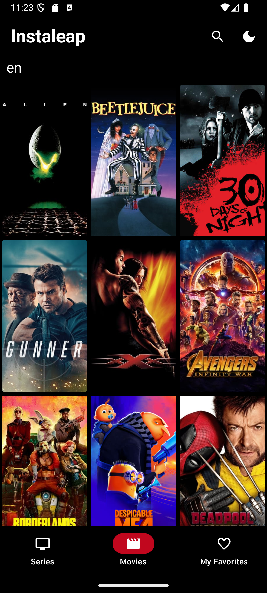
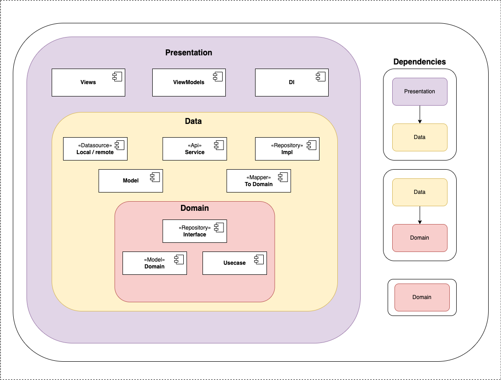
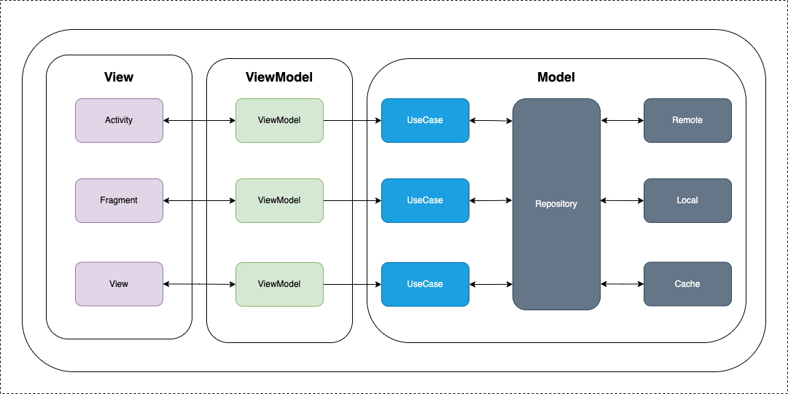

# Aplicación de Películas y Series - Clean Architecture

Una aplicación móvil que permite a los usuarios explorar películas y series, gestionar una lista de favoritos, realizar búsquedas avanzadas, y personalizar la apariencia con un modo oscuro. Desarrollada usando **Kotlin**, **Jetpack Compose**, y siguiendo los principios de **Clean Architecture**, con soporte para **modo offline** y pruebas unitarias en todas las capas.

<!-- Capturas de pantalla -->

  
  
  
  
  

## Características

1. **Exploración de Películas y Series**: Los usuarios pueden navegar por un catálogo de películas y series, con información detallada sobre cada contenido.
2. **Modo Offline**: La aplicación puede funcionar sin conexión a internet, manteniendo datos previamente consultados.
3. **Búsqueda Avanzada**: Permite a los usuarios buscar películas y series por título, género, y otros filtros.
4. **Favoritos**: Los usuarios pueden agregar películas y series a su lista de favoritos.
5. **Modo Oscuro**: La aplicación soporta modo oscuro para una experiencia de usuario más personalizada.
6. **Control de Conexión a Internet**: Muestra el estado de la conexión a internet con un banner informativo.
7. **Auto Sincronización**: Los datos se sincronizan automáticamente cuando hay conexión disponible, utilizando **WorkManager** y **NetworkConnectivityStream**.
8. **Paginación**: Optimización en la carga de grandes volúmenes de datos, mejorando la experiencia de usuario.
9. **Pruebas Unitarias en Todas las Capas**: La aplicación incluye una cobertura exhaustiva de pruebas unitarias para garantizar la calidad del código.
## Demo en Video

[Ver el video de demostración en tamaño de teléfono](https://drive.google.com/file/d/13Yx2PPatEKruO9tTK_yTSZ86hq4N-BNt/view?usp=sharing)

## API

La aplicación consume datos de la API de **The Movie Database** para obtener información actualizada sobre películas y series.

## Arquitectura Clean

### Principios Básicos

La aplicación está dividida en varias capas que permiten la separación de responsabilidades, siguiendo los principios de **Clean Architecture**:

1. **Capa de Dominio**: Contiene las reglas de negocio y es independiente de cualquier framework o tecnología.
2. **Capa de Datos**: Gestiona la obtención de datos desde la API y el almacenamiento local.
3. **Capa de Presentación**: Se encarga de la lógica de interfaz de usuario utilizando **Jetpack Compose**.

Cada capa solo puede interactuar con las capas inferiores, garantizando un flujo de dependencias controlado.
- **Arquitectura General**
  

## Estructura

A continuación, se muestran los diagramas de la arquitectura y estructura de la aplicación:

## Tecnologías Utilizadas 🛠

- **Kotlin**: Lenguaje de programación principal para el desarrollo de la aplicación.
- **Jetpack Compose**: Herramienta moderna de Google para la creación de interfaces nativas.
- **Coroutines**: Para el manejo eficiente de operaciones asíncronas.
- **Flow**: Para trabajar con flujos asíncronos de datos.
- **StateFlow**: Un reemplazo de LiveData para el manejo del estado de la UI.
- **Room**: Biblioteca de persistencia que proporciona una abstracción sobre SQLite para un acceso más robusto a la base de datos local.
- **Retrofit**: Cliente HTTP seguro para Android y Java que permite consumir la API de The Movie Database.
- **WorkManager**: Para la planificación de tareas asincrónicas y diferidas, como la sincronización de datos en segundo plano.
- **Paging 3**: Para la carga y presentación eficiente de grandes cantidades de datos en la aplicación.
- **ViewModel**: Para almacenar datos relacionados con la UI y sobrevivir a los cambios de configuración.
- **SavedStateHandle**: Para restaurar el estado de la UI de forma segura entre destrucciones y recreaciones de la actividad.
- **Navigation Components**: Facilita la navegación entre fragmentos y actividades en la aplicación.
- **Hilt**: Manejo de inyección de dependencias de manera más sencilla.
- **Mockito**: Para crear mocks y facilitar las pruebas unitarias.
- **JUnit**: Framework para la escritura y ejecución de pruebas unitarias.
- **Detekt**: Herramienta estática para analizar y asegurar la calidad del código.
- **Kover**: Para la generación de reportes detallados de cobertura de pruebas unitarias.

## Pruebas Unitarias

La aplicación cuenta con pruebas unitarias en todas sus capas, garantizando que cada funcionalidad cumpla con las expectativas. Utilizamos herramientas como **Mockito** para las pruebas de mocking, y **JUnit** para validar la lógica de negocio y de datos.

